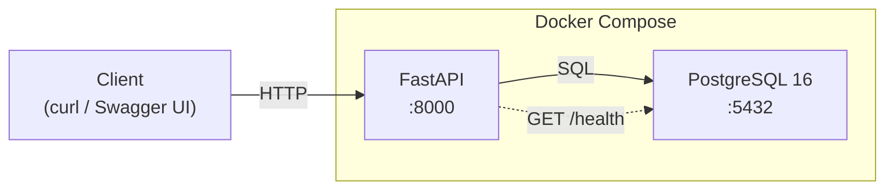
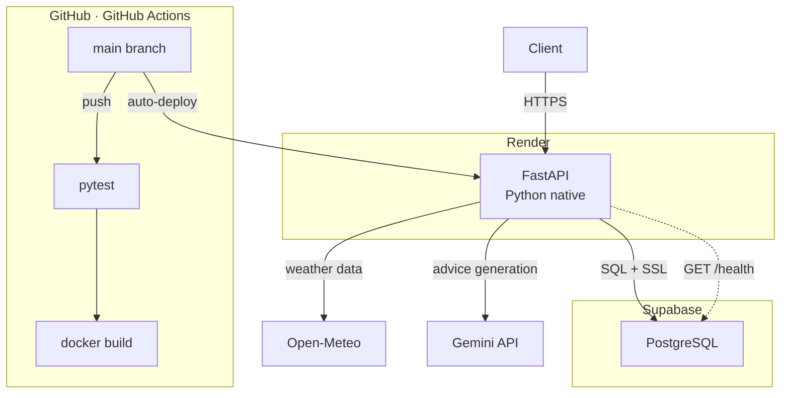
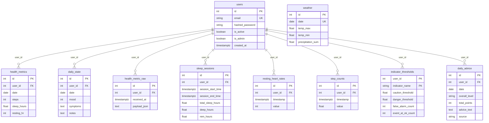

# Health × Weather AI Advisor

A backend API that analyzes daily health metrics and weather data
to estimate personal health risk and generate daily health advice.

This project is designed as an MVP to explore how environmental factors,
such as weather conditions, can be combined with personal health data
to provide interpretable and actionable health insights.

---

## Overview

This service ingests daily weather data and personal health metrics,
evaluates health risk using rule-based logic,
and generates daily health advice using an LLM with fallback handling.

The project focuses on:
- Interpretability over black-box prediction
- Reproducible backend architecture
- Future extensibility toward preventive and emergency healthcare use cases

> Gemini CLI was used as a coding support tool during implementation. System design, API design, and data flow were planned by the developer.

---

## Motivation

Many existing health applications focus on data visualization,
but do not clearly explain how external factors such as weather
affect daily physical condition.

This project aims to bridge that gap by:
- Explicitly modeling weather-related health risks
- Providing human-readable explanations and advice
- Serving as a foundation for future medical and healthcare AI systems

---

## Features

- Ingest daily weather data from Open-Meteo
- Ingest personal health metrics (e.g. heart rate, sleep, mood)
- Rule-based health risk evaluation (OK / Caution / Danger)
- AI-generated daily health advice with fallback logic
- Persistent storage of analysis and advice results
- Reuse stored advice to avoid redundant computation

---

## Architecture

Data flow:

1. Weather and health data are ingested via API endpoints
2. Analysis module evaluates daily health risk
3. Advice module generates personalized advice using an LLM
4. Results are stored in a database and reused when available

The system is implemented as a RESTful API using FastAPI.

### Local Environment



Two Docker Compose services: `api` (FastAPI on port 8000) and `db` (PostgreSQL 16).
The `db` health check gates `api` startup. `/health` confirms DB connectivity at runtime.

### Production



FastAPI runs on Render (Python native). Supabase provides managed PostgreSQL connected via `DATABASE_URL`.
GitHub Actions runs tests and a Docker build check on every push. Render auto-deploys from `main`.
`/health` is the Render health check endpoint — it verifies DB connectivity on each deploy.

---

## Database Schema

10 tables total. All personal health data is scoped per user via `user_id`.
`weather` is shared reference data and intentionally has no user association.



**Design notes:**
- Personal health data tables are associated with users via a `user_id` foreign key. CRUD queries are scoped by `user_id` to support user-level data separation.
- `weather` has no `user_id` — weather is environmental reference data shared across all users.
- `indicator_thresholds` uses a composite primary key `(user_id, indicator_name)` to store per-user thresholds for each of the 8 health indicators. Thresholds can be adjusted based on false alarm and missed event history using rule-based logic.
- `daily_advice` enforces `UNIQUE(user_id, date)`, caching one generated advice entry per user per day to minimize LLM API calls.
- `health_metric_raw` stores the original Apple Health export payload, enabling reprocessing if the parsing logic is updated.

For detailed database design, see [db.md](./db.md).

---

## Tech Stack

### Backend
- Python 3.13
- FastAPI
- SQLAlchemy
- JWT Authentication (python-jose + passlib)

### Database
- PostgreSQL (production)
- Supabase (managed PostgreSQL hosting)
- SQLite (tests only)

### AI / Analysis
- Rule-based health risk evaluation
- Gemini API (LLM-based advice generation)

### External Services
- Open-Meteo

### Infrastructure / Dev Tools
- Docker / Docker Compose
- GitHub Actions
- Render
- pytest

---

## Tech Selection Rationale

**FastAPI** — Automatic Swagger UI generation, Pydantic-based request validation, and async support. Reduces boilerplate while keeping the API contract explicit and type-safe.

**SQLAlchemy** — The same ORM layer runs against SQLite (tests) and PostgreSQL (production) by switching `DATABASE_URL`. Schema control stays close to the code without raw SQL.

**PostgreSQL on Supabase** — Managed PostgreSQL with connection pooling and SSL. No self-managed infrastructure; the connection is consumed via a single `DATABASE_URL`.

**Render** — Python-native deployment with shell-expanded `$PORT`. Auto-deploys from `main` via GitHub integration without maintaining a production Dockerfile.

**GitHub Actions** — CI defined as code alongside the application. Runs tests and validates the Docker build on every push to catch issues before they reach production.

**Rule-based Analysis** — Health risk scoring uses explicit rules rather than a trained model. Decision logic stays auditable and requires no labeled training data.

---

## API Endpoints

### Public

| Method | Path | Description |
|---|---|---|
| GET | `/health` | DB connectivity check |
| POST | `/auth/signup` | Create user account |
| POST | `/auth/login` | Get JWT access token |

### Authenticated

| Method | Path | Description |
|---|---|---|
| GET | `/auth/me` | Get current user info |
| POST | `/ingest/weather` | Ingest weather data (admin only) |
| POST | `/ingest/health_metrics` | Ingest wearable health data |
| POST | `/ingest/daily_state` | Ingest daily mood and symptoms |
| GET | `/summary/last7d` | 7-day health summary |
| GET | `/analysis/{date}` | Daily risk analysis (admin only) |
| GET | `/advice/{date}` | Generate or retrieve daily advice |

Detailed request/response specs are available via Swagger UI at `/docs`.

---

## Environment Variables

Copy `.env.example` to `.env` and configure the following:

| Variable | Required | Description |
|---|---|---|
| `DATABASE_URL` | ✅ | Database connection string. Docker Compose sets this automatically. |
| `SECRET_KEY` | ✅ | JWT signing key. Generate with `openssl rand -hex 32`. |
| `ACCESS_TOKEN_EXPIRE_MINUTES` | — | JWT expiry in minutes. Default: `30`. |
| `LLM_PROVIDER` | — | Set to `gemini` to enable Gemini API. Default: `none` (rule-based fallback). |
| `GEMINI_API_KEY` | ✅ (LLM) | Gemini API key. Required only when `LLM_PROVIDER=gemini`. |
| `GEMINI_MODEL` | — | Gemini model name. Default: `gemini-1.5-flash`. |

See `.env.example` for all options including Supabase connection string patterns.

---

## Run with Docker

### Requirements
- Docker
- Docker Compose

### Setup

Copy `.env.example` to `.env`:

```bash
cp .env.example .env
```

Docker Compose sets `DATABASE_URL` automatically — no manual DB configuration needed.
Set `GEMINI_API_KEY` only if using the LLM feature.

```
SECRET_KEY=your-secret-key        # openssl rand -hex 32
LLM_PROVIDER=none                 # set to "gemini" to enable Gemini API
GEMINI_API_KEY=your_api_key_here  # required only if LLM_PROVIDER=gemini
```

### Run

Docker Compose starts both the FastAPI application (`api`) and a PostgreSQL database (`db`):

```
docker compose up --build
```

The API will be available at: http://localhost:8000/docs

---

## Running Tests

Install dependencies and run the test suite:

```bash
pip install -r requirements.txt
pytest tests/ -v
```

Tests use SQLite as an in-process database — no PostgreSQL instance required.
The same test suite runs automatically on every push via GitHub Actions.

---

## Deploy to Render + Supabase

FastAPI runs on Render as a Python-native service (no Docker in production).
PostgreSQL is hosted on Supabase — the connection string is passed via `DATABASE_URL`.

Render auto-deploys on every push to `main`. `/health` is configured as the `healthCheckPath`,
verifying DB connectivity after each deploy.

Key environment variables to set in the Render dashboard:
- `DATABASE_URL` — Supabase connection string (`?sslmode=require` included)
- `SECRET_KEY` — JWT signing key (auto-generated via `render.yaml`)
- `GEMINI_API_KEY` — required only if `LLM_PROVIDER=gemini`

See `render.yaml` for the full service configuration.

---

## Roadmap

- Dynamic city management (config file or database)
- Web-based interface
- Per-user threshold customization via settings API
- Migrate `health_metrics` aggregates into time-series tables

---

## Disclaimer

This project is for educational and experimental purposes only.
It is not intended for medical diagnosis or treatment.
