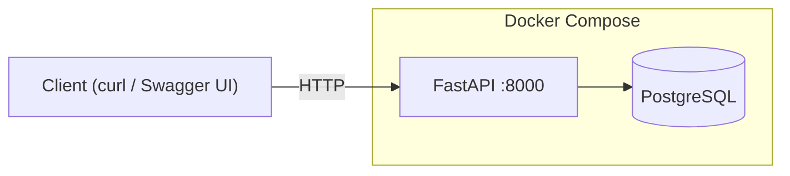
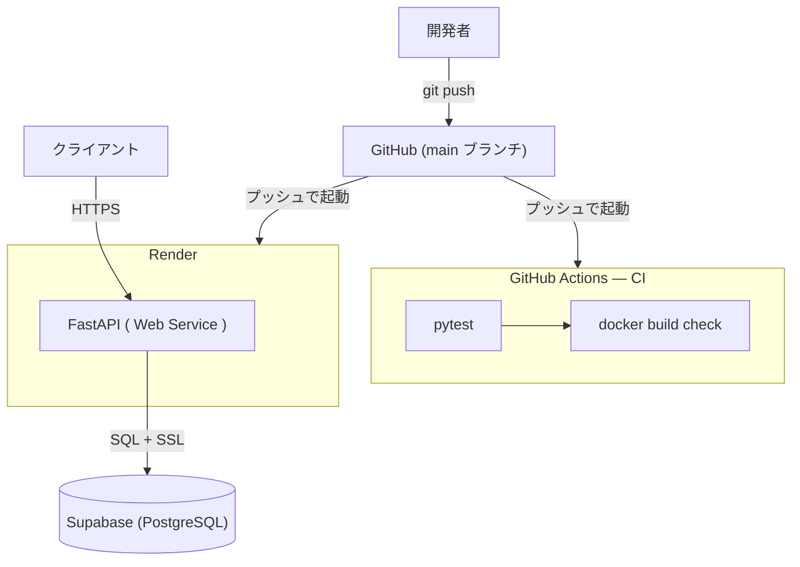
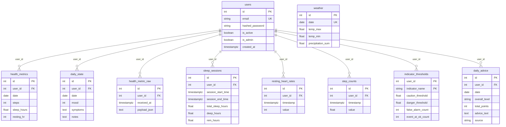

# Health × Weather AI Advisor（日本語）

本プロジェクトは、日々の健康データと天候データを組み合わせて
健康リスクを評価し、アドバイスを生成するバックエンドAPIです。

医療・ヘルスケア分野における
「環境要因 × 個人データ」の活用可能性を検証するMVPとして設計しています。

---

## 概要

- 天候データと健康データをAPI経由で取り込み
- ルールベースで健康リスクを評価
- LLMを用いて日次アドバイス文を生成
- 結果をデータベースに保存し再利用

解釈可能性と再現性を重視した設計になっています。

> 実装補助として Gemini CLI を使用しています。システム構成・API設計・データフローの設計は開発者が行いました。

---

## 背景・目的

多くの健康アプリはデータの可視化に留まり、
「なぜ今日体調が悪いのか」「何に注意すべきか」
といった説明が不足していると感じていました。

本プロジェクトでは、天候などの外部要因を明示的に扱い、
人が理解しやすい形で健康リスクとアドバイスを提示することを目的としています。

---

## 主な機能

- Open-Meteoによる天候データ取得
- 心拍数・睡眠・気分などの健康データ取り込み
- OK / Caution / Danger のリスク判定
- LLMによるアドバイス生成（フォールバックあり）
- 分析結果・アドバイスの永続化

---

## アーキテクチャ

本プロジェクトは、天候データと健康データを日付単位で統合し、
解析・文章化・保存までを一貫して行うバックエンドAPIとして設計しています。

### データフロー（概要）

1. 天候データおよび健康データを API 経由で取り込む
2. 解析モジュールにて、ルールベースで日次の健康リスクを評価
3. 評価結果（構造化JSON）をもとに、LLMが自然言語のアドバイス文を生成
4. 解析結果およびアドバイス文をデータベースに保存し、再利用する

LLMは「判断」には使用せず、
**解析結果を自然言語に変換する役割に限定**することで、
説明可能性と安全性を重視した設計としています。

APIは FastAPI により実装されており、
Webサイトや他クライアントからの利用を前提とした構成です。

### ローカル環境



### 本番環境



**CI/CD：** GitHub Actions はプッシュのたびに `pytest` → `docker build check` を順番に実行します（CI のみ — デプロイは担当しません）。
Render Auto Deploy は独立してリポジトリを監視し、main ブランチへのプッシュを直接検知してデプロイします。

**実行時アクセス：** クライアントは HTTPS で Render の FastAPI に接続し、
FastAPI は SSL 接続で Supabase PostgreSQL に問い合わせます。

## データベース設計

全10テーブル構成。個人の健康データはすべて `user_id` でユーザーごとに分離されています。
`weather`（気象データ）はユーザーに紐づかない共通の参照データです。



**設計上のポイント：**
- 個人の健康データを持つテーブルには `user_id` 外部キーを持たせています。CRUD層では `user_id` によるフィルタリングを行い、ユーザーごとのデータ分離を意識した設計にしています。
- `weather` は地域の環境データであるため、`user_id` を持たない共通参照テーブルとして設計しています。
- `indicator_thresholds` は `(user_id, indicator_name)` を複合主キーとし、8種類の健康指標の閾値をユーザーごとに管理します。誤検知や見逃しの履歴に基づき、ルールベースで閾値を調整できる設計です。
- `daily_advice` は `UNIQUE(user_id, date)` により、同一ユーザー・同日のアドバイスを1回だけ生成してキャッシュし、LLM APIの余分な呼び出しを抑制します。
- `health_metric_raw` はApple Healthからの生データをそのまま保存することで、パースロジックの変更時に再処理できる構造にしています。

各テーブルの詳細な役割・設計意図については [db.md](./db.md) を参照してください。

---

## 使用技術（Tech Stack）

### バックエンド
- Python 3.13
- FastAPI
- SQLAlchemy
- JWT 認証（python-jose + passlib）

### データベース
- PostgreSQL（本番）
- Supabase（managed PostgreSQL ホスティング）
- SQLite（テスト用途のみ）

### AI / 解析
- Rule-based health risk evaluation
- Gemini API（LLMによるアドバイス生成）

### 外部サービス
- Open-Meteo

### インフラ / 開発ツール
- Docker / Docker Compose
- GitHub Actions
- Render
- pytest

---

## 技術選定理由

**FastAPI** — Swagger UI の自動生成、Pydantic によるリクエストバリデーション、非同期サポートが目的。ボイラープレートを削減しつつ、APIの仕様を型で明示できます。

**SQLAlchemy** — `DATABASE_URL` を切り替えるだけで SQLite（テスト）と PostgreSQL（本番）を同一のORM層で扱えます。スキーマ管理をコードに寄せつつ生SQLを排除するために採用しました。

**PostgreSQL on Supabase** — コネクションプーリングとSSLを備えたマネージドPostgreSQL。インフラを自己管理せず、接続文字列（`DATABASE_URL`）1つで利用できます。

**Render** — シェル展開される `$PORT` を使えるPython nativeデプロイが可能。本番用Dockerfileの管理が不要で、`main` ブランチからの自動デプロイをGitHub連携で実現します。

**GitHub Actions** — CI設定をコードとしてリポジトリで管理します。pushのたびにテストとDockerビルドを検証し、本番への問題混入を防ぎます。

**ルールベース解析** — 健康リスクの評価には学習モデルではなく明示的なスコアリングルールを使用します。判断の根拠が追跡可能で、ラベル付きデータも不要です。

---

## 認証

v1.0.0 よりマルチユーザー対応になりました。
データ取得・分析・アドバイス系 API はすべて JWT 認証が必要です。

### セットアップ

`.env.example` を `.env` にコピーし、`SECRET_KEY` を変更してください。

```bash
cp .env.example .env
# SECRET_KEY に openssl rand -hex 32 の出力を設定
```

### ユーザー登録

```bash
curl -X POST http://localhost:8000/auth/signup \
  -H "Content-Type: application/json" \
  -d '{"email": "you@example.com", "password": "yourpassword"}'
```

### ログイン（JWT 取得）

```bash
curl -X POST http://localhost:8000/auth/login \
  -H "Content-Type: application/x-www-form-urlencoded" \
  -d "username=you@example.com&password=yourpassword"
# → {"access_token": "eyJ...", "token_type": "bearer"}
```

### 認証付きリクエスト例

```bash
TOKEN="eyJ..."   # ↑ で取得したトークン

# アドバイス取得
curl http://localhost:8000/advice/2025-12-20 \
  -H "Authorization: Bearer $TOKEN"

# 健康データ取り込み
curl -X POST http://localhost:8000/ingest/health_metrics \
  -H "Authorization: Bearer $TOKEN" \
  -H "Content-Type: application/json" \
  -d '{"data": {"metrics": [...]}}'

# 気象データ取り込み
curl -X POST http://localhost:8000/ingest/weather \
  -H "Authorization: Bearer $TOKEN" \
  -H "Content-Type: application/json" \
  -d '{"date": "2025-12-20", "temp_max": 18.5, "temp_min": 10.2}'

# 7日間サマリー
curl http://localhost:8000/summary/last7d \
  -H "Authorization: Bearer $TOKEN"
```

### Swagger UI での動作確認

`/docs` を開き、画面右上の **Authorize** ボタンをクリックして
`username`（メールアドレス）と `password` を入力すると、
全エンドポイントを認証済み状態で試せます。

---

## API エンドポイント一覧

### パブリック

| Method | Path | 説明 |
|---|---|---|
| GET | `/health` | DB疎通確認 |
| POST | `/auth/signup` | ユーザー登録 |
| POST | `/auth/login` | ログイン・JWT 取得 |

### 認証済み（要JWT）

| Method | Path | 説明 |
|---|---|---|
| GET | `/auth/me` | 認証ユーザー情報取得 |
| POST | `/ingest/weather` | 気象データ取り込み（管理者のみ） |
| POST | `/ingest/health_metrics` | ウェアラブルデータ取り込み |
| POST | `/ingest/daily_state` | 体調ログ取り込み |
| GET | `/summary/last7d` | 直近7日間サマリー |
| GET | `/analysis/{date}` | 日次リスク分析（管理者のみ） |
| GET | `/advice/{date}` | 自然言語アドバイス生成 |

詳細なリクエスト・レスポンス仕様は、Swagger UI（`/docs`）から確認できます。

---

## 環境変数一覧

`.env.example` を `.env` にコピーし、以下の変数を設定してください。

| 変数名 | 必須 | 説明 |
|---|---|---|
| `DATABASE_URL` | ✅ | DB接続文字列。Docker Compose使用時は自動設定。 |
| `SECRET_KEY` | ✅ | JWT署名鍵。`openssl rand -hex 32` で生成。 |
| `ACCESS_TOKEN_EXPIRE_MINUTES` | — | JWTの有効期限（分）。デフォルト: `30`。 |
| `LLM_PROVIDER` | — | `gemini` でGemini API有効化。デフォルト: `none`（ルールベースフォールバック）。 |
| `GEMINI_API_KEY` | ✅（LLM使用時） | Gemini APIキー。`LLM_PROVIDER=gemini` の場合のみ必要。 |
| `GEMINI_MODEL` | — | 使用モデル名。デフォルト: `gemini-1.5-flash`。 |

Supabase接続文字列のパターンなど詳細は `.env.example` を参照してください。

---

## Dockerによる起動（推奨）

Dockerを使用することで、ローカル環境にPythonをインストールせずにAPIを起動できます。

### 必要なもの
- Docker
- Docker Compose

### セットアップ

`.env.example` を `.env` にコピーします。

```bash
cp .env.example .env
```

Docker Compose が `DATABASE_URL` を自動設定するため、DBの手動設定は不要です。
LLM機能を使用する場合のみ `GEMINI_API_KEY` を設定してください。

```
SECRET_KEY=your-secret-key        # openssl rand -hex 32
LLM_PROVIDER=none                 # gemini に設定するとGemini API有効
GEMINI_API_KEY=your_api_key_here  # LLM_PROVIDER=gemini の場合のみ
```

### 起動方法

Docker Compose が FastAPI アプリ（`api`）と PostgreSQL（`db`）を起動します。

```
docker compose up --build
```

起動後、以下にアクセスできます： http://localhost:8000/docs

---

## テスト実行方法

依存関係をインストールし、テストを実行します。

```bash
pip install -r requirements.txt
pytest tests/ -v
```

テストはインプロセスの SQLite を使用します。PostgreSQL は不要です。
`main` ブランチおよび `features/**` への push のたびに GitHub Actions で自動実行されます。

---

## Render + Supabase へのデプロイ

FastAPI は Render 上で Python native サービスとして稼働します（本番環境でDockerは使用しません）。
PostgreSQL は Supabase をホスティングに利用し、`DATABASE_URL` で接続します。

`main` ブランチへの push で Render が自動デプロイします。
`/health` が `healthCheckPath` として設定されており、デプロイのたびにDB疎通を確認します。

Render ダッシュボードで設定する主な環境変数：
- `DATABASE_URL` — Supabaseの接続文字列（`?sslmode=require` を含む）
- `SECRET_KEY` — JWT署名鍵（`render.yaml` で自動生成も可能）
- `GEMINI_API_KEY` — `LLM_PROVIDER=gemini` の場合のみ必要

詳細は `render.yaml` を参照してください。

---

## 今後の改善予定

- 対応都市の動的管理（設定ファイルまたはDB）
- Webインターフェースの作成
- ユーザーごとの閾値カスタマイズ（設定API）
- `health_metrics` の時系列テーブルへの統合

---

## 注意事項

本プロジェクトは学習・検証目的のものであり、
医療行為や診断を目的としたものではありません。
